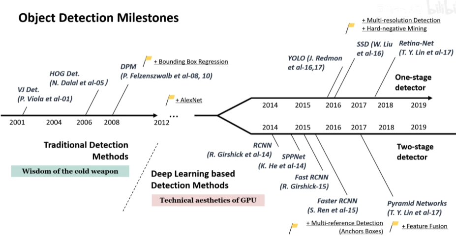
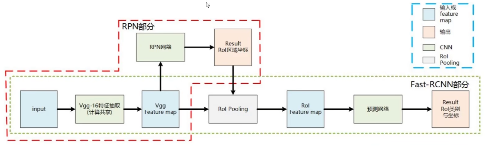

# 概述

## [单阶段目标检测](https://blog.csdn.net/weixin\_45325331/article/details/113328884#RetinaNet\_311)

#### YOLO系列

* YOLO v1-2015
* YOLO v2-2016
* YOLO v3-2018
* YOLO v4-2020.04
* YOLO v5-2020.05
* YOLO v6-2022.06
* YOLO v7-2022.07
* YOLO v8-2023.01

#### SSD-2016

#### RetinaNet-Focal Loss

## [双阶段目标检测](https://blog.csdn.net/weixin\_45325331/article/details/111394398?ops\_request\_misc=%257B%2522request%255Fid%2522%253A%2522169660320616800222885583%2522%252C%2522scm%2522%253A%252220140713.130102334.pc%255Fall.%2522%257D\&request\_id=169660320616800222885583\&biz\_id=0\&utm\_medium=distribute.pc\_search\_result.none-task-blog-2\~all\~first\_rank\_ecpm\_v1\~rank\_v31\_ecpm-1-111394398-null-null.142^v94^insert\_down28v1\&utm\_term=%E7%9B%AE%E6%A0%87%E6%A3%80%E6%B5%8B%E7%BB%BC%E8%BF%B0%E2%80%94%E2%80%94%E5%8F%8C%E9%98%B6%E6%AE%B5%E6%A3%80%E6%B5%8B%E5%99%A8\&spm=1018.2226.3001.4187)

* RCNN
* SPPNet
* Fast RCNN
* Faster RCNN
* Feature Pyramid Networks（FPN）

## 什么是目标检测

在图像上画出一个框, 需要四个参数: 中心点的 x 轴, y 轴坐标, 框的高和宽

## 目标检测综述论文:&#x20;

Object Detection in 20 Years: A Survey

## 著名的数据集

* VOC-2007
* VOC-2012
* ILSVRC-2014
* ILSVRC-2017
* MS-COCO-2015
* MS-COCO-2018
* OID-2018

## 目标检测里程碑

<figure><figcaption></figcaption></figure>

### Two Stage

先进行区域生成，该区域称之为 region proposal（简称RP，一个有可能包含待检物体的预选框），再通过卷积神经网络进行样本分类

任务流程：特征提取 --> 生成RP --> 分类/定位回归。

* RCNN
* SPP-Net
* Fast R-CNN
* Faster  R-CNN
* FCN

Faster-RCNN&#x20;

<figure><figcaption></figcaption></figure>

### One Stage

直接把图形喂到模型中, 直接输出结果 (快但不准确)

* YOLO
* SSD
* Retina-Net

YOLO系列

* YOLO-V1 CVPR 2016
* YOLO-V2 YOLO 9000 CVPR 2017
* YOLO-V3 CVPR 2018
* YOLO-V4 CVPR 2020
* YOLO-V5 CVPR 2021  YOLO-X 2021

传统的目标检测流水线

1. 候选区生成-通过滑动窗口选择感兴趣区域ROI; 使用多尺寸的输入图像和多尺度的滑动窗口识别多尺度和不同比例的目标
2. 特征提取-SIFT, Harr, HOG, SURF
3. 区域分类-常用支持向量机, 结合集成, 串联学习, 梯度提升的方法提高准确率

卷积神经网络应用于目标检测

1.  两阶段-Two Stage

    先生成候选区域, 在对区域做预测. 精度高, 速度慢

    如: R-CNN, SPP-net, fast R-CNN, faster R-CNN, R-FCN, FPN, Mask R-CNN, Cascade R-CNN
2.  单阶段-One Stage

    把图像的每个可能区域看做候选区域. 精度低, 速度快

    如: OverFeat, YOLO, SSD, RetinaNet, YOLOv2, YOLOv3, CornerNet, YOLOv4

<figure><figcaption></figcaption></figure>

* Backbone: 卷积网络, 将输入图像转换成特征映射
* Neck
* Dense Prediction
* Sparse Prediction

Feature Pyramid Networks-FPN

* 卷积网络的浅层特征具有较强的空间信息, 具有较高分辨率, 适合较小的目标
* 卷积网络的深层特征具有较强的语义信息, 具有较大的感受野, 适合较大的目标
* FPN是将浅层特征和深层结合起来, 主要有三个部分
  *   自底向上的通路

      实现前向传播, 生成不同程度的分辨率和语义信息
  *   自顶向下的通路

      生成多尺度的特征映射
  *   平衡连接

      连接卷积特征与构造特征. 为特征映射增加图像信息

<figure><figcaption></figcaption></figure>

比较通用的算法侧优化是backbone(resnet resnext resnest efficientNet等大模型，mobilenet hrnet shufflenet等系列小模型)，Neck(fpn, bi-fpn,panet等各种FPN层)，比较实用的网络优化(deform\_conv，se-net，cbam等attention结构)，head优化(主要是target设计的方方面面。

比如检测anchor-base和anchor-free之间的差异就是在于target和输出之间加了一个anchor作为桥梁)，训练策略优化(主要集中在正负样本均衡，损失函数设计，比如过采样，欠采样，损失函数比如FocalLoss，triplet\_loss，训练流程上比如OHEM等)。

训练参数优化(CosineLearningRate等LR方面的优化，AutoAugment、Mixup、CutOut等数据增强方面的优化)，预训练模型(基于无监督大数据Moco等, 大分辨率pretrain, 最差也得ImageNet-pretrain了，这块NLP方面做的比较好，CV这块我比较看好无监督或者半监督的方法)，新方案(ViT，DETR等transformer在CV里的各种应用)。

