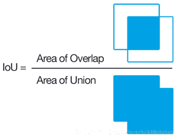

# 评价指标

## Intersection over Union (IoU)

两个box区域的交集比上并集

* 首先计算两个box左上角点坐标的最大值和右下角坐标的最小值
* 然后计算交集面积
* 最后把交集面积除以对应的并集面积

<figure><figcaption></figcaption></figure>



## Mean Average Precision (mAP)

* 对于每一类物体, 我们可以根据模型的预测结果和真实标签计算一个PR曲线 (Precision-Recall Curve)
* 在这个曲线上, Precision是纵轴, Recall 是横轴, 我们可以计算出这个曲线下的面积, 这个面积就是AP
* 在计算mAP时, 我们是考虑位置信息, 类别信息和置信度


