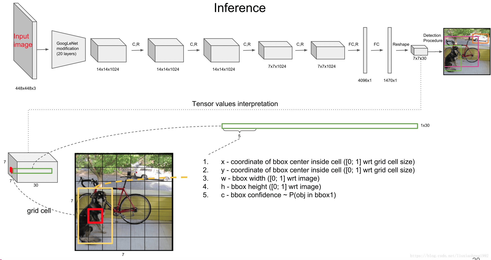
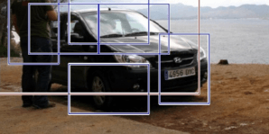
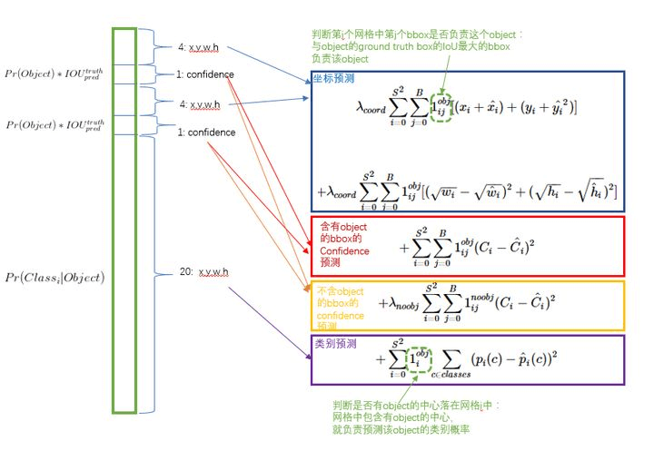

# YOLO-V1







## 参考博客

* [https://cuijiahua.com/blog/2021/05/dl-basics-5.html](https://cuijiahua.com/blog/2021/05/dl-basics-5.html)
* [https://github.com/watersink/yolov1\_tutorial](https://github.com/watersink/yolov1\_tutorial)

## 核心思想

采用利用整张图作为网络的输入，直接在输出层回归 bounding box 的位置和 bounding box 所属的类别

## 检测过程

**第一步-Resize image**&#x20;

**输入图片大小为 448×448**

将不同尺寸的图片适配到统一的网络结构中，需要 resize 到相同的尺寸

**第二步-Run convolutional network**

<figure><figcaption></figcaption></figure>

最终输出是 7×7×30

* 7×7很好理解, 图像分为 7x7 个区域进行预测
* 前五个数值, 分别是 bbox 的 x,y, w, h, c (两组)
  * x, y 指的是 bbox 的中心坐标
  * w, h 指的是 bbox 的宽高
  * c 指的是 bbox的置信度
* 后面的20个指的是类别概率 (VOC数据集)
* tensor - 7×7×(2×5+20) - S×S×(B×5+C)

**第三步-Non-max suppression-非极大值抑制**

[https://github.com/watersink/yolov1\_tutorial](https://github.com/watersink/yolov1\_tutorial)

非极大值抑制顾名思义就是抑制不是极大值的元素, 搜索局部的极大值

## 

就像上面的图片一样，定位一个车辆，最后算法就找出了一堆的方框，我们需要判别哪些矩形框是没用的。非极大值抑制的方法是：先假设有6个矩形框，根据分类器的类别分类概率做排序，假设从小到大属于车辆的概率 分别为A、B、C、D、E、F

1. 从最大概率矩形框F开始，分别判断A\~E与F的重叠度IOU是否大于某个设定的阈值;
2. 假设B、D与F的重叠度超过阈值，那么就扔掉B、D；并标记第一个矩形框F，是我们保留下来的
3. 从剩下的矩形框A、C、E中，选择概率最大的E，然后判断E与A、C的重叠度，重叠度大于一定的阈值，那么就扔掉；并标记E是我们保留下来的第二个矩形框

## 损失函数

<figure><figcaption></figcaption></figure>

## 评价指标

$$Pr(Class_i | Object) * Pr(Object)*IOU_{pred}^{truth} = Pr(Class_i)  *IOU_{pred}^{truth}$$

* $$Pr(Class_i | Object)$$: 这是给定有一个物体在图像中, 该物体属于类别i的概率. 换句话说, 这是模型对物体类别的预测的**置信度**
* $$Pr(Object)$$: 这是检测框 (bounding box) 内存在一个物体的概率. 在训练过程中, 模型会预测每个边界框是否包含物体, 然后用这个概率乘以其他部分
* $$IOU$$ : 这是预测的边界框 (bounding box) 和实际的边界框之间的交并比 ( Intersection over Union). 这个值越大, 预测的边界框就越接近真实的边界框

## 局限性

尽管 YOLO-v1是一个具有创新性的实时物体检测模型, 然而, 它也存在一些限制:

* **定位错误:** 它对边界框的预测是直接从卷积层输出, 没有经过任何后处理或调整, 导致预测的边界框位置可能不精确
* **对小目标的检测困难:** 特别是当小目标在图像中密集或者重叠时
* **处理类别不均衡的问题:** 对于数据较少的类别, 模型的性能可能会较差
* **对重叠物体的检测困难:** 它使用单个网络单元预测一个物体
* **模型对物体的尺度敏感:** 它对于中等尺度的检测效果较好, 但对于较大或较小尺度的物体, 其检测性能可能会下降
