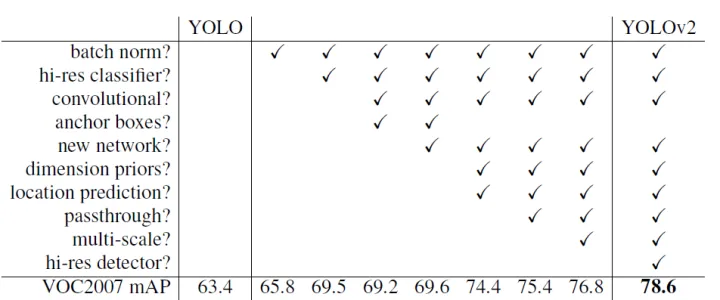

# YOLO-V2

## 参考博客

* [YOLO9000: Better, Faster, Stronger](https://arxiv.org/abs/1612.08242)
* [https://zhuanlan.zhihu.com/p/35325884](https://zhuanlan.zhihu.com/p/35325884)

## YOLO-V2的改进策略

<figure><figcaption></figcaption></figure>

## Batch Normalization

**Batch Normalization**可以提升模型**收敛速度**，而且可以起到一定**正则化**效果，降低模型的过拟合。在YOLOv2中，每个卷积层后面都添加了Batch Normalization层，并且不再使用droput。使用Batch Normalization后，YOLOv2的mAP提升了2.4%。

## Convolutional With Anchor Boxes

* Dimension Clusters 在边界框进行聚类, 以获得先验框
* Direct location prediction 预测边界框中心点相对于对应cell左上角位置的相对偏移值

在YOLOv1中，输入图片最终被划分为 7×7 网格，每个单元格预测2个边界框。YOLOv1最后采用的是全连接层**直接**对边界框进行预测，其中边界框的宽与高是相对整张图片大小的，而由于各个图片中存在**不同尺度**和**长宽比**（scales and ratios）的物体，YOLOv1在训练过程中学习适应不同物体的形状是比较困难的，这也导致YOLOv1在精确定位方面表现较差。

YOLOv2借鉴了Faster R-CNN中RPN网络的**先验框**（anchor boxes，prior boxes，SSD也采用了先验框）策略。

* 思想来源于 Faster R-CNN中的 Region Proposal Network (RPN), 它通过预定义一些具有不同形状和尺寸的边界框, 然后让模型预测这些边界框的偏移量, 而不是直接预测边界框的坐标. 这种方式可以帮助模型更好地处理不同形状和尺寸的对象.
  * **数据准备:** 归一化处理宽度和高度, 以消除图片大小影响, 大量 w, h (即每个边界框)可以表示成二维坐标上的点
  * **聚类分析:** 对上述得到的点进行聚类, k表示想要得到先验框的数量. 聚类分析时选用box与聚类中心box之间的IOU值作为距离指标
  * **先验框确定:** 最后, 聚类的结果就是预定义的先验框
* YOLOv2移除了YOLOv1中的全连接层而采用了卷积和anchor boxes来预测边界框

