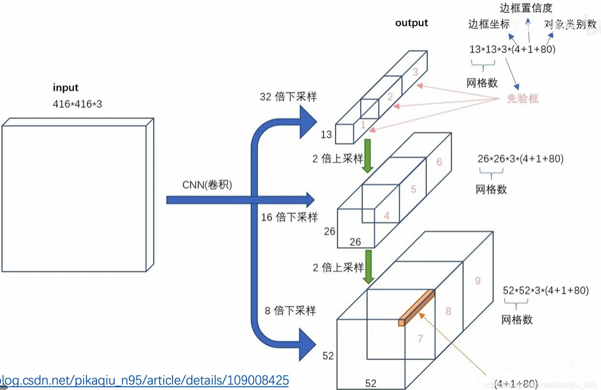

# YOLO-V3

[YOLO-V3 精度论文 + 代码复现](https://www.bilibili.com/video/BV1Vg411V7bJ/?spm\_id\_from=333.337.search-card.all.click)

## 参考博客

* [YOLOv3: An Incremental Improvement](https://arxiv.org/abs/1804.02767)
* [https://medium.com/image-processing-and-ml-note/yolov3-you-only-look-once-object-detection-13a312c7336f](https://medium.com/image-processing-and-ml-note/yolov3-you-only-look-once-object-detection-13a312c7336f)
* [https://zhuanlan.zhihu.com/p/76802514](https://zhuanlan.zhihu.com/p/76802514)

## YOLO-V3主要改进

* **多尺度预测:** 与前两个版本相比, YOLO-V3在3个不同的尺度上进行预测, 这使得模型在检测大小不同的对象时效果更好. 它通过应用 1×1 滤波器并下采样特征图来获得不同的尺度
* **使用了3中不同尺度的先验框:** 对于每个尺度, YOLO-V3使用3个先验框, 这个改变使得模型在检测各种形状的对象时能够做的更好
* **类别无关的对象性检测:** YOLO-V3引入了一个类别无关的对象性检测机制, 这使得它可以更好地处理覆盖, 遮挡或难以识别的对象 (二值交叉熵代替L2损失)
* **使用 Darknet-53 网络结构:** YOLO-V3使用 DarkNet-53 作为其基础架构, 这是一个深度网络, 由卷积层, 池化层和连接层组成. 这使得模型在保持高速度的同时也具有很高的准确性
* **使用逻辑回归进行类别预测:** 不同于前两个版本使用 softmax, YOLO-V3采用了多标签分类的策略, 使用逻辑回归进行类别预测, 这使得模型在处理多类别标签时更为灵活

## YOLO-V3模型

* 训练的是COCO数据集, 80个类别
* 网络输出3个不同大小的 feature map, 这三个的感受野不同, 作者用他们负责识别不同大小的目标
* 作者在聚类挑选**先验框**的时候, 分成了9个cluster
  * 特征图 13×13: (116×90), (156×198), (373×326)
  * 特征图 26×26: (30×61), (62×45), (59×119)
  * 特征图 52×52: (10×13), (16×30), (33×23)
* N × N × \[3 \* (4 + 1 + 80)]
  * 4 bounding box offsets
  * 1 objectness prediction
  * 80 class predictions

<figure><figcaption></figcaption></figure>

<figure><figcaption></figcaption></figure>

### YOLO-V3训练过程

<figure><figcaption>
训练过程
</figcaption></figure>

### YOLO-V3测试过程

<figure><figcaption>
测试过程
</figcaption></figure>

## 损失函数

<figure><figcaption></figcaption></figure>

