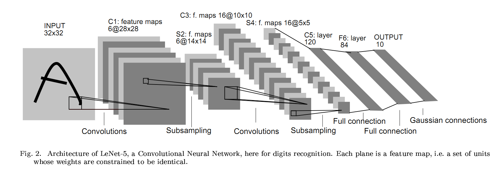
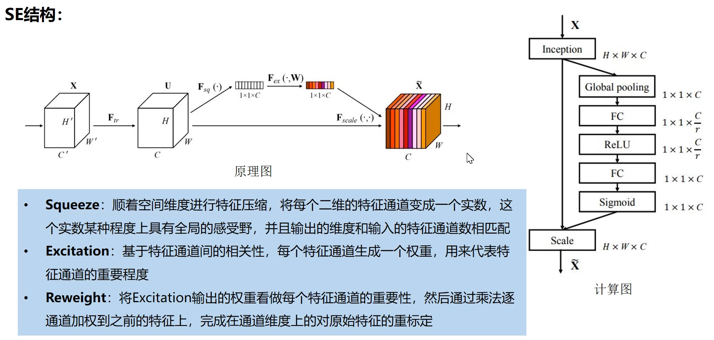

# LeNet

参考资料

* [https://www.kaggle.com/code/blurredmachine/lenet-architecture-a-complete-guide](https://www.kaggle.com/code/blurredmachine/lenet-architecture-a-complete-guide)
* [https://medium.com/@deepeshdeepakdd2/lenet-5-implementation-on-mnist-in-pytorch-c6f2ee306e37](https://medium.com/@deepeshdeepakdd2/lenet-5-implementation-on-mnist-in-pytorch-c6f2ee306e37)
* [https://www.bilibili.com/video/BV1t44y1r7ct?p=1](https://www.bilibili.com/video/BV1t44y1r7ct?p=1)
* [https://medium.com/analytics-vidhya/lenet-architecture-document-recognition-ed971ab2a23f](https://medium.com/analytics-vidhya/lenet-architecture-document-recognition-ed971ab2a23f)


## LeNet网络结构

* 先使用卷积层来学习图片空间信息
* 然后使用全连接层来转换到类别空间

<figure><figcaption></figcaption></figure>

<figure><figcaption></figcaption></figure>

## MNIST

* 50000个训练数据
* 10000个测试数据
* 图像大小 28×28
* 10 类

## 搭建LeNet-5模型

```python
### 搭建LeNet-5模型
import torch.nn as nn
from torchsummary import summary
class LeNet5(nn.Module):
    # 初始化网络结构
    def __init__(self):
        super().__init__()
        self.conv1 = nn.Conv2d(in_channels=1, out_channels=6, kernel_size=5, stride=1, padding=0)
        self.pool1 = nn.MaxPool2d(kernel_size=2, stride=2, padding=0)
        self.conv2 = nn.Conv2d(in_channels=6, out_channels=16, kernel_size=5, stride=1, padding=0)
        self.pool2 = nn.MaxPool2d(kernel_size=2, stride=2, padding=0)
        self.conv3 = nn.Conv2d(in_channels=16, out_channels=120, kernel_size=5, stride=1, padding=0)
        
        self.flatten = nn.Flatten() # 将多维的输入一维化，常用在卷积层到全连接层的过渡
        self.fc1 = nn.Linear(in_features=120, out_features=84)
        self.output = nn.Linear(in_features=84, out_features=10)

 
    # 前向传播
    def forward(self, x):
        x = self.relu(self.conv1(x))
        x = self.pool1(x)
        x = self.relu(self.conv2(x))
        x = self.pool2(x)
        x = self.relu(self.conv3(x))
        x = self.flatten(x)
        x = self.relu(self.fc1(x))
        x = self.fc1(x)
        x = self.output(x)
        return x

model = LeNet5()
summary(model, input_size=(1, 28, 28))
```

