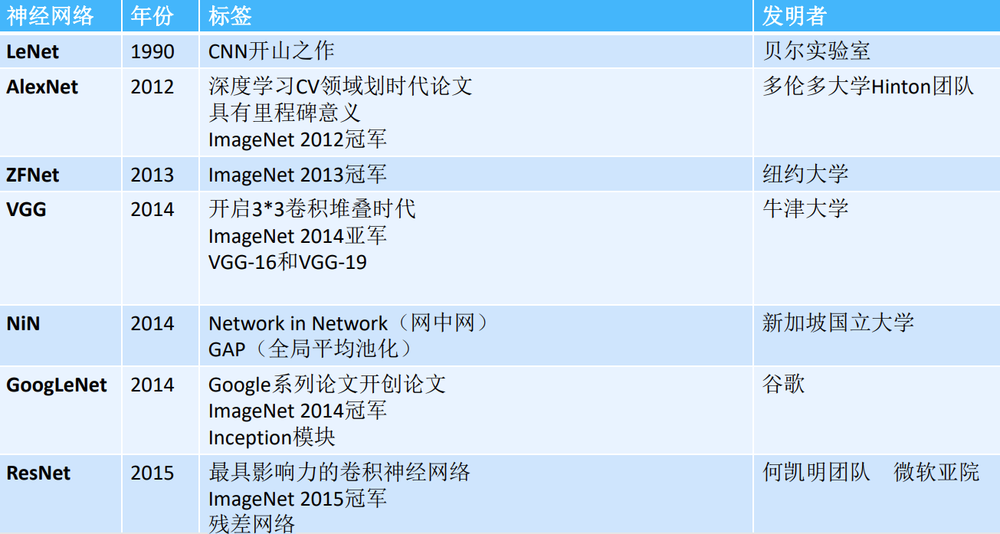
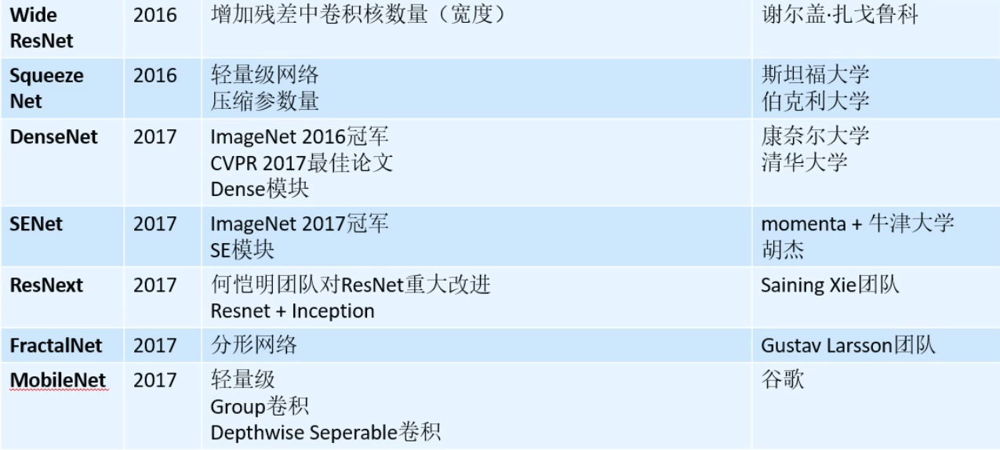

# 经典卷积神经网络

## 发展脉络

LeNet -> AlexNet -> ZFNet -> VGG -> NiN -> GoogLeNet -> ResNet -> DenseNet -> ResNetXt -> EfficientNet

<figure><figcaption></figcaption></figure>

<figure><figcaption></figcaption></figure>

## 早期探索

* LeNet
* AlexNet
* ZFNet
* VggNet

## 深度化

* ResNet
* DenseNet

## 模块化

* GoogleNet-Inception v1-v3
* Inception-ResNet
* ResNeXt
* Xception

## 注意力机制

* SENet
* cSE, sSE, scSE
* CBAM

## 高效化

* SqueezeNet
* MobileNet
* ShuffleNet
* GhostNet

## 自动化

* NASNet
* EfficientNet

<figure><figcaption></figcaption></figure>

<figure><figcaption></figcaption></figure>

<figure><figcaption></figcaption></figure>

<figure><figcaption></figcaption></figure>

## 参考资料

* [深度学习之卷积神经网络](https://www.bilibili.com/video/BV1AJ411Q72b/?p=2\&vd\_source=4afb0374462e2a6a5fe3309f3b19500d)
* [卷积神经网络的结构发展](https://www.bilibili.com/video/BV1E54y1B7Ub/?spm\_id\_from=333.337.search-card.all.click\&vd\_source=4afb0374462e2a6a5fe3309f3b19500d)
