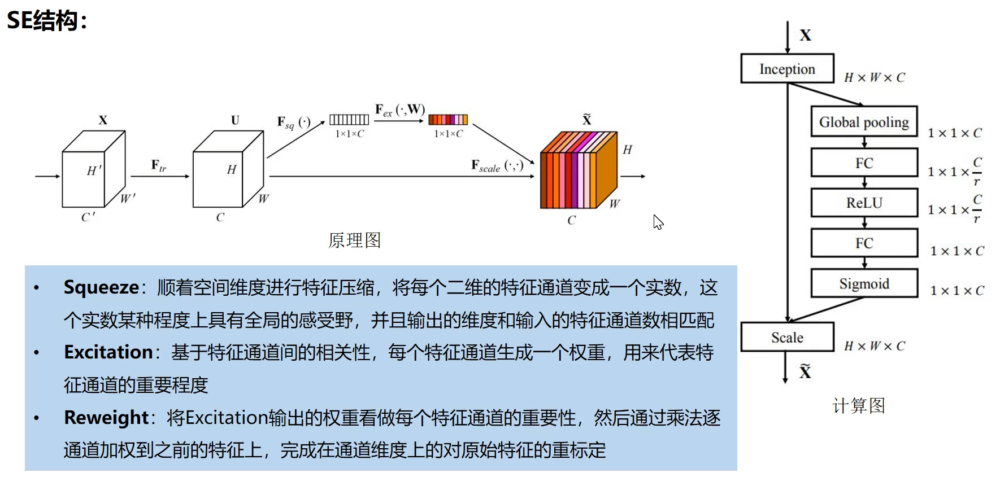

# DenseNet

[Paper: Densely Connected Convolutional Networks](https://arxiv.org/abs/1608.06993)

## 一、什么是 DenseNet?

DenseNet 就是密集连接的卷积网络。它与 ResNet 非常相似。但有一些本质区别。ResNet 使用的是加法方法，这意味着它们将**之前的输出作为未来层的输入**，而 DenseNet 则将**之前的所有输出作为未来层的输入。**

<figure><figcaption></figcaption></figure>

## 二、为什么需要 DenseNets？

* 解决梯度消失问题，由于输入层和输出层之间的距离较长，信息在到达目的地之前就消失
* 进一步提高 accuracy

## 三、DenseNets 网络结构

## 参考资料

* [Introduction to DenseNets (Dense CNN)](https://www.analyticsvidhya.com/blog/2022/03/introduction-to-densenets-dense-cnn/)
