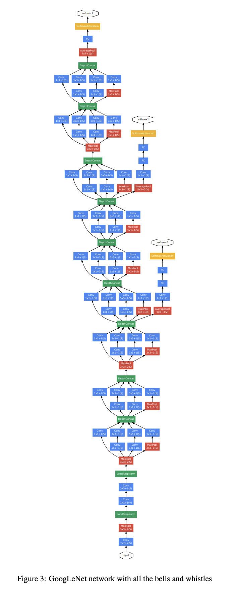

# GoogLeNet

Paper: Going deeper with convolutions

## Inception 技术演进

V1 (GoogleNet) → BN-Inception → V2 → V3 → V4 → Inception-ResNet → XInception

## GoogLeNet 创新点

* Inception 模块
* 目标检测阶段应用 R-CNN 类似的方法
  * muti-box prediction

## GoogLeNet 网络结构

* **先用传统 CNN 结构, 后面用 Inception 模块堆叠**
* 增加深度 (层数) 和宽度 (卷积核个数) 的同时减少计算量, 比 2012 年的 AlexNet 参数少 12 倍
* 输入是 224 × 224 × 3 的 RGB 图像
* 所有卷积都使用 ReLu 激活函数
* 用全局平均池化 (GAP) 代替全连接层
  * 偏于 fine-tune 迁移学习
  * 提升了 0.6% 的 Top-1 准确率
  * 仍然使用 Dropout 层
* 浅层分类器 L = L(最后) + 0.3 × L(辅1) + 0.3 × L(辅2)
  * 后面被证实没有什么用, 在Inception v2-v3 中去掉了&#x20;

<figure><figcaption></figcaption></figure>

<figure><figcaption></figcaption></figure>

## Inception 模块

* 利用多尺度的分支进处理, 构建了一个模块, 然后逐渐堆叠这个模块; 并且随着模型的加深, 3×3 和 5×5 卷积核比例逐渐提高. 这样的操作会使得**视觉信息多尺度并行分开处理再融合汇总**
* 版本 (a) 存在的问题是作业本堆叠越来越厚 (通道数越来越多) 导致计算量爆炸; 解决办法, 在 3×3 和 5×5 卷积之前使用 1×1卷积

<figure><figcaption></figcaption></figure>

重要启发源文献1-Network in Network&#x20;

* 1 × 1 卷积 + ReLU
  * 降维
  * 减少参数运算律
  * 增加模型深度, 提高非线性表达能力
* Global Average Pooling 取代全连接层

重要启发源文献1-Provable Bounds for Learning Some Deep representions

* 理论研究
* 用稀疏, 分散的网络取代以前庞大密集臃肿的网络
* 用稀疏连接取代密集连接 (Arora et al. \[2], Hebbian pricipal)

## 参考资料

* [同济子豪兄](https://www.bilibili.com/video/BV17g411L7Se/?p=2\&spm\_id\_from=pageDriver\&vd\_source=4afb0374462e2a6a5fe3309f3b19500d)
