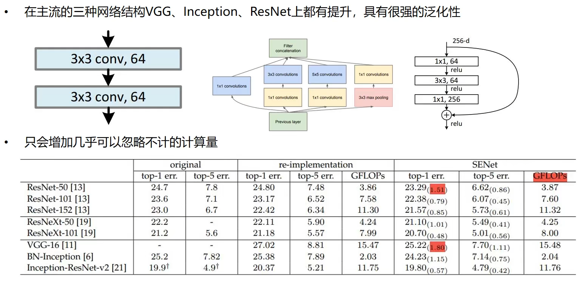

# SENet

## 一、为什么需要 Attention 机制

* 模仿人类视觉机制， 只关注部分区域， 忽略无关区域
* 在 NLP 领域 Attention 取得了巨大成功， CV 领域开始借鉴
* 神经网络 Attention 图可视化

## 二、SE结构

<figure><figcaption></figcaption></figure>

## 三、设计原理

<figure><figcaption></figcaption></figure>

<figure><figcaption></figcaption></figure>

## 四、代码实现

```python
class SELayer(nn.Module):
    def __init__(self, channel, reduction=16):
        super(SELayer, self).__init__()
        self.avg_pool = nn.AdaptiveAvgPool2d(1)
        self.fc = nn.Sequential(
            nn.Linear(channel, channel//reduction, bias=False)
            nn.ReLU(inplace=True)
            nn.Linear(channel//reduction, channel, bias=False)
            nn.Sigmoid()
        )
    
    def forward(self, x):
        b, c, _, _ = x.size()
        y = self.avg_pool(x).view(b,c)
        y = self.fc(y).view(b, c, 1, 1)
        return x * y.expand_as(x)
```

## 五、效果分析

<figure><figcaption></figcaption></figure>

## 参考资料：

* [【CV中的注意力机制】SENet](https://www.bilibili.com/video/BV1QA411F7rR/?spm\_id\_from=333.337.search-card.all.click\&vd\_source=4afb0374462e2a6a5fe3309f3b19500d)
